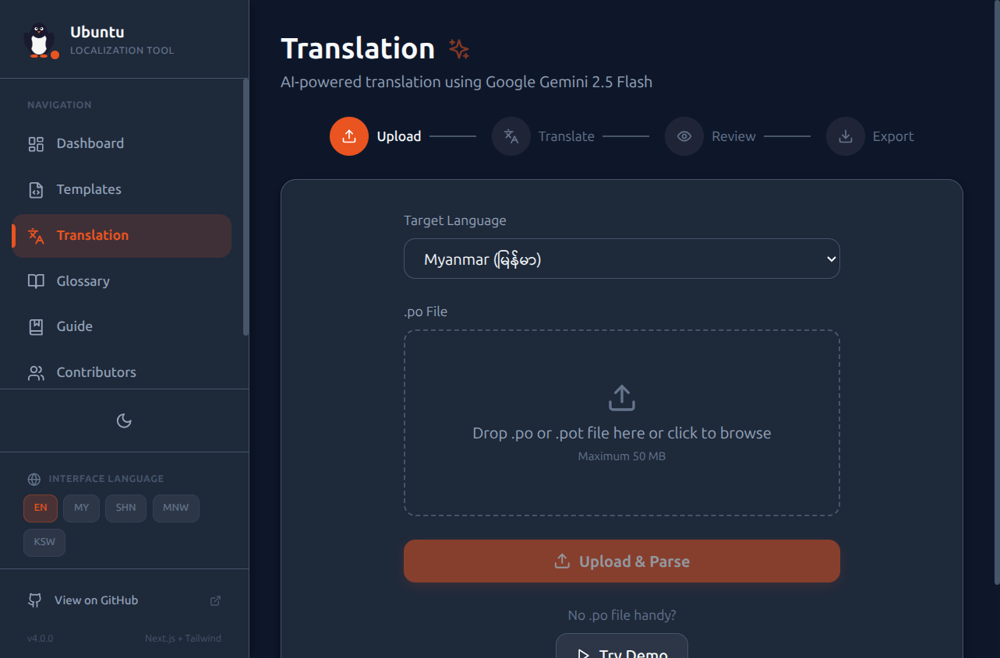
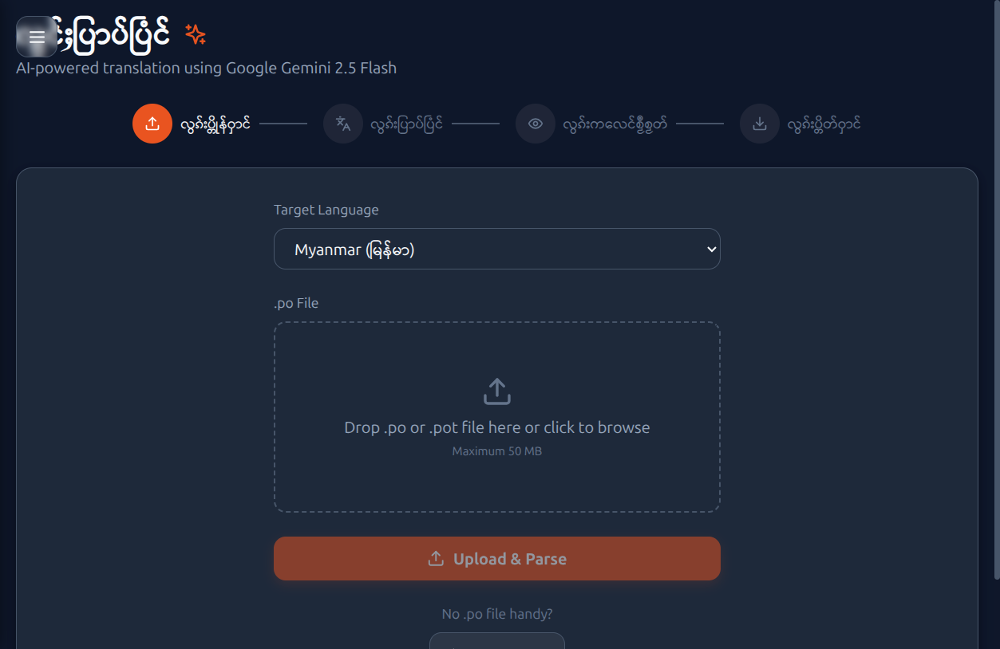
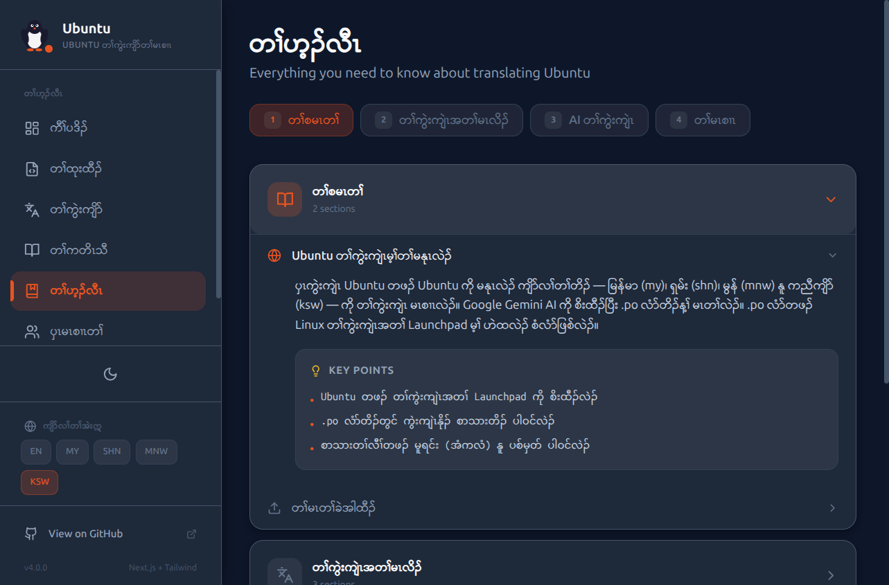
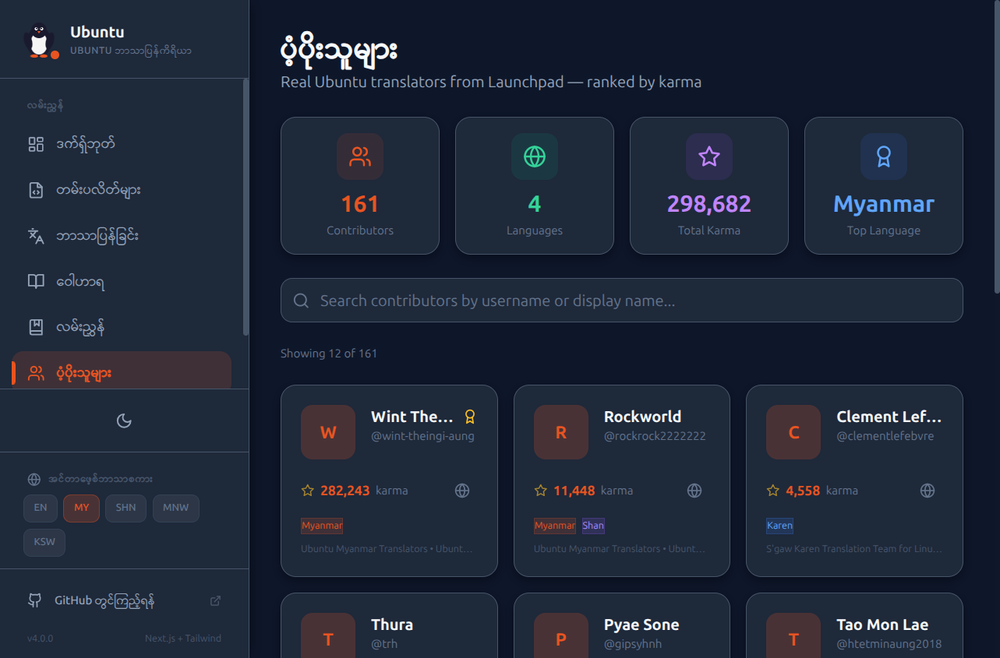

# Ubuntu Localization Tool 🐧

An AI-powered localization tool for translating Ubuntu `.po` files into indigenous languages using Google Gemini AI.

## Supported Languages

| Language | Code | Script |
|----------|------|--------|
| Myanmar | `my` | Myanmar Unicode |
| Shan | `shn` | Shan Unicode |
| Mon | `mnw` | Mon Unicode |
| S'gaw Karen | `ksw` | S'gaw Karen Unicode |

## Features

- **Upload** `.po`/`.pot` files via drag-and-drop — language auto-detected from file metadata
- **AI translation** powered by Google Gemini 2.5 Flash with Ubuntu-specific context awareness
- **Batch processing** — translate up to 15 strings at a time with automatic quality checks
- **Manual editing** — side-by-side grid with auto-save on every field
- **Export** — download the translated `.po` file directly from the browser
- **Single-page workflow** — upload, translate, and export all on one unified page
- **Interactive guide** — 6-chapter walkthrough for new translators
- **Contributors** — per-language contributor rankings and stats
- **Templates** — browse 550+ Ubuntu packages on Launchpad
- **Glossary** — 153 standardized translation terms across 4 languages
- **Dark/Light theme** — Ubuntu-themed UI with system preference detection
- **i18n** — UI available in English, Myanmar, Shan, Mon, and S'gaw Karen

## Screenshots


*Dashboard — Dark theme with English UI*


*Templates page — 550 Ubuntu packages, Shan language*


*Translation workspace — AI-powered .po file translation, Mon language*


*Interactive translation guide — S'gaw Karen language*


*Contributor leaderboard — Myanmar language*

## Tech Stack

- **Framework**: Next.js 14 (App Router)
- **UI**: React 18 + TypeScript
- **Styling**: Tailwind CSS 3.4
- **AI**: Google Gemini 2.5 Flash
- **Icons**: Lucide React
- **Deployment**: Vercel

## Folder Structure

```
ubuntu-localization/
├── frontend/                  # Next.js application
│   ├── src/
│   │   ├── app/               # App Router pages
│   │   │   ├── api/           # API routes (translate, upload, export)
│   │   │   ├── contributors/  # Contributors leaderboard
│   │   │   ├── glossary/      # Translation glossary
│   │   │   ├── guide/         # Translation guide
│   │   │   ├── history/       # Export history
│   │   │   ├── templates/     # Ubuntu package browser
│   │   │   └── translate/     # Main translation workspace
│   │   ├── components/        # Reusable React components
│   │   ├── data/              # Static JSON data (translations, glossary, etc.)
│   │   └── lib/               # Utilities (translate, po-parser, i18n, constants)
│   ├── public/                # Static assets
│   ├── package.json           # Dependencies and scripts
│   ├── tailwind.config.ts     # Tailwind configuration
│   └── tsconfig.json          # TypeScript configuration
├── .claude/                   # Claude Code configuration
│   ├── agents/                # Subagent definitions (translate-batch, qa-reviewer)
│   ├── skills/                # Slash command skills
│   └── workflows/             # Orchestration workflows
├── screenshots/               # Application screenshots
├── slides/                    # Presentation materials
├── .mcp.json                  # MCP server configuration
└── CLAUDE.md                  # Project instructions for Claude Code
```

## Installation

```bash
git clone https://github.com/Wint-Theingi-Aung/ubuntu-localization.git
cd ubuntu-localization/frontend

# Install dependencies
npm install

# Set your Gemini API key
echo "GOOGLE_API_KEY=your_key_here" > .env
```

## Development

```bash
cd frontend

# Start development server
npm run dev
```

Open **http://localhost:3000** — the app hot-reloads on file changes.

## Build

```bash
cd frontend

# Production build
npm run build

# Start production server
npm start
```

## Deployment (Vercel)

The project is configured for Vercel deployment:

```bash
vercel --prod
```

Set `GOOGLE_API_KEY` as an environment variable in the Vercel dashboard.

## Localization Workflow

1. **Upload** — Drop a `.po` or `.pot` file on the translate page
2. **Translate** — Use AI batch translation or edit manually
3. **QA Check** — Automatic placeholder, newline, and length verification
4. **Export** — Download the translated `.po` file

### CLI Skills (Claude Code)

| Command | Purpose |
|---------|---------|
| `/po-upload` | Parse .po files, extract untranslated strings |
| `/po-detect` | Scan for missing/fuzzy translations, prioritize by visibility |
| `/po-translate` | AI batch translation with 3-reviewer QA verification |
| `/po-export` | Write back to .po file for browser download |
| `/po-description` | Generate human-readable .po file summaries and stats |
| `/pr-description` | Auto-generate structured pull request descriptions |

## API Routes

| Route | Method | Purpose |
|-------|--------|---------|
| `/api/upload` | POST | Parse uploaded .po file |
| `/api/translate` | POST | Batch translate with Gemini AI |
| `/api/export` | POST | Generate downloadable .po file |
| `/api/progress` | GET/POST | Translation session progress |

## Contributing

1. Fork the repository
2. Create a feature branch (`git checkout -b feature/amazing-feature`)
3. Commit your changes (`git commit -m 'Add amazing feature'`)
4. Push to the branch (`git push origin feature/amazing-feature`)
5. Open a Pull Request

## License

MIT
