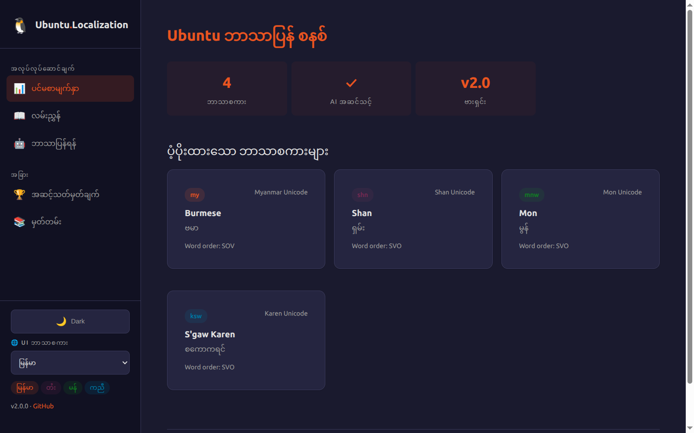
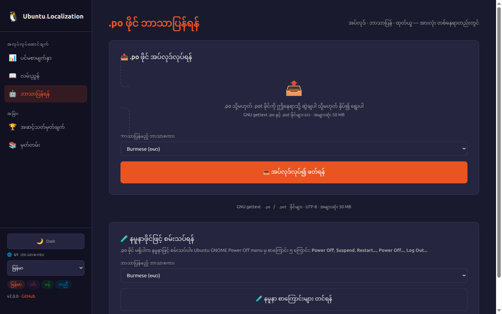
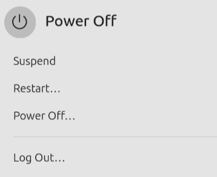

# Ubuntu Localization Tool 🐧

An AI-powered localization tool for translating Ubuntu `.po` files into indigenous languages using Google Gemini AI.

## Supported Languages

| Language | Code | Script |
|----------|------|--------|
| Burmese | `my` | Myanmar Unicode |
| Shan | `shn` | Shan Unicode |
| Mon | `mnw` | Mon Unicode |
| S'gaw Karen | `ksw` | S'gaw Karen Unicode |

## Features

- **Upload** `.po`/`.pot` files via drag-and-drop — language auto-detected from file metadata
- **AI translation** powered by Google Gemini 2.5 Flash with Ubuntu-specific context awareness
- **Batch processing** — translate up to 15 strings at a time with automatic quality checks
- **Manual editing** — side-by-side grid with auto-save on every field
- **Export** — download the translated `.po` file directly from the browser
- **Single-page workflow** — upload, translate, and export all on one unified page

## Screenshots


*Homepage — language cards, recent sessions, and quick access to translate*


*Translate — unified upload, AI/manual translation, and export pipeline*

### Real-World Translation Example

Ubuntu GNOME Power Off menu localized for Myanmar users:

<table>
<tr>
<td align="center"><strong>English (Before)</strong></td>
<td align="center"><strong>Myanmar (After)</strong></td>
</tr>
<tr>
<td></td>
<td></td>
</tr>
</table>

## Tech Stack

- **Web UI**: FastAPI + Jinja2 + htmx (Ubuntu-themed)
- **AI**: Google Gemini 2.5 Flash
- **PO parsing**: polib
- **Package manager**: uv

## Quick Start

```bash
git clone https://github.com/Wint-Theingi-Aung/ubuntu-localization.git
cd ubuntu-localization

# Install dependencies
uv sync

# Set your Gemini API key
echo "GOOGLE_API_KEY=your_key_here" > .env

# Start the server
uv run uvicorn backend.main:app --reload
```

Open **http://localhost:8501/translate/** — upload a `.po` file, translate with AI, and download the result.

## Web UI Routes

| Route | Purpose |
|-------|---------|
| `/` | Dashboard — language overview, recent sessions |
| `/translate/` | Unified pipeline: upload → AI/manual translate → export |
| `/guide/` | 6-chapter interactive user guide |
| `/leaderboard/` | Top contributors per language |
| `/leaderboard/contributor/{name}` | Individual contributor stats |
| `/export/history` | Export history |
| `/health` | Health check endpoint |

## CLI Skills (Claude Code)

| Command | Purpose |
|---------|---------|
| `/po-upload` | Parse .po files, extract untranslated strings |
| `/po-detect` | Scan for missing/fuzzy translations, prioritize by visibility |
| `/po-translate` | AI batch translation with 3-reviewer QA verification |
| `/po-export` | Write back to .po file for browser download |
| `/po-description` | Generate human-readable .po file summaries and stats |
| `/pr-description` | Auto-generate structured pull request descriptions |

## Deployment (Vercel)

```bash
vercel --prod
```

Entry point: `index.py` — imports the FastAPI app from `backend.main`.

## License

MIT
