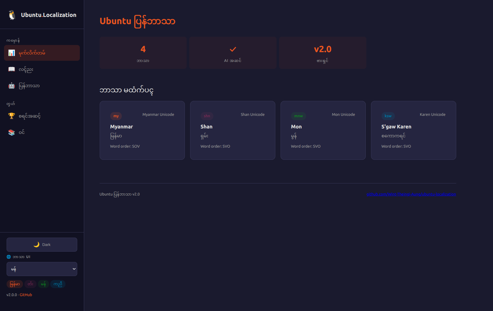
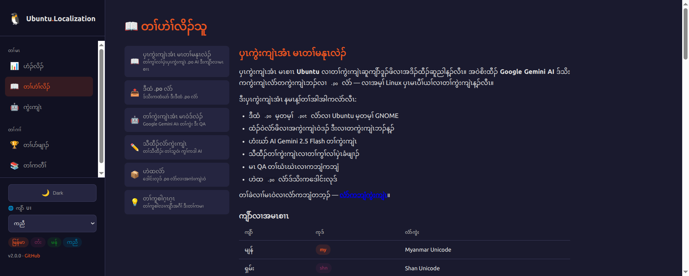
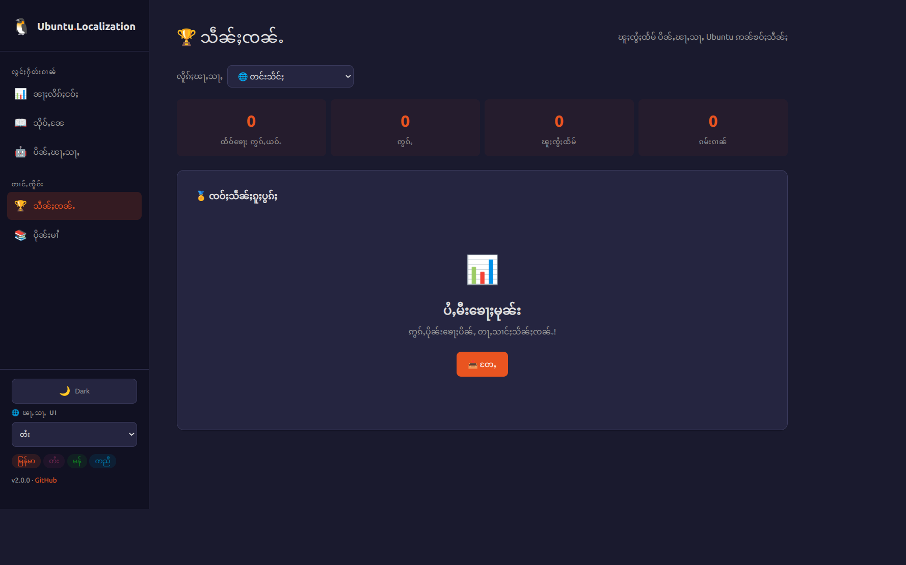

<!--
  Marp template — "terminal-dark"
  Copy this file into your repo (e.g. slides/intro.md) and replace the content.
  Render:  marp slides/intro.md -o slides/slides.html      (or .pdf / .png)
  Theme is self-contained in the <style> block below — no external CSS needed.
-->
---
marp: true
paginate: true
size: 16:9
---

<style>
@import url('https://fonts.googleapis.com/css2?family=JetBrains+Mono:wght@400;500;700&family=Inter:wght@400;600;800&display=swap');
:root {
  --bg:#0d1117; --ink:#e6edf3; --muted:#8b949e;
  --accent:#3fb950; --accent2:#58a6ff; --line:#30363d; --code:#161b22;
}
section {
  background:var(--bg); color:var(--ink);
  font-family:'Inter','Noto Sans','Pyidaungsu',sans-serif;
  font-size:27px; line-height:1.5; padding:56px 72px;
}
h1,h2,h3 { font-family:'JetBrains Mono',monospace; }
h1 { color:var(--accent); font-weight:700; border-bottom:3px solid var(--line); padding-bottom:.2em; }
h2 { color:var(--accent2); font-weight:500; }
h3 { color:var(--ink); }
strong { color:var(--accent); }
a { color:var(--accent2); text-decoration:none; }
code { background:var(--code); color:var(--accent); padding:.06em .35em; border-radius:5px; font-family:'JetBrains Mono',monospace; }
pre  { background:var(--code); border:1px solid var(--line); border-radius:10px; }
pre code { background:none; color:#e6edf3; }
blockquote { border-left:4px solid var(--accent); background:#11161d; color:var(--muted); padding:.5em 1em; }
table th { background:#161b22; color:var(--accent2); }
table td, table th { border-color:var(--line); }
header,footer,section::after { color:var(--muted); font-size:.5em; }
section.cover {
  background:radial-gradient(900px 400px at 80% 12%, rgba(63,185,80,.18), transparent 60%), var(--bg);
}
section.cover h1 { border-bottom:none; font-size:2.3em; }
section.cover .tags code { background:#11161d; color:var(--accent2); margin-right:.4em; }
section.lead { background:#11161d; }
section.lead h1 { border-bottom:none; }
</style>

<!-- _class: cover -->

# Ubuntu Localization Platform

## AI-powered .po translation and localization tool

**Wint Theingi Aung** · @Wint-Theingi-Aung

<span class="tags">`#built-with-claude` `#vibecode.tours` `#fastapi` `#jinja2` `#htmx` `#gemini-ai` </span>

---

# What it is

- A web-based localization tool for `.po` files
- Helps translators + developers work faster with AI assistance
- Combines AI translation + manual editing workflow

---

# How it works

```bash
# the core flow in 3 commands
uv sync
uv run fastapi dev main.py
# open http://localhost:8000
```

Stack: **FastAPI + Jinja2 + htmx + Google Gemini 2.5 Flash + polib + uv** · built with Claude Code

---

<!-- _class: lead -->

# Landing Page — Mon



---

<!-- _class: lead -->

# Guide Page — S'gaw Karen



---

<!-- _class: lead -->

# Translate Page — Myanmar


---

<!-- _class: lead -->

# Contributors — Shan



---

# Links

- **Live:** Live: https://ubuntu-localization.vercel.app/
- **Repo:** https://github.com/Wint-Theingi-Aung/ubuntu-localization
- **License:** MIT
